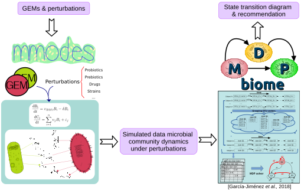

# **MDPbiomeGEM**




### Description
**MDPbiomeGEM** is a combination of the published system [MDPbiome](https://github.com/beatrizgj/MDPbiome) and Genome-scale Metabolic models (GEMs).
Multiple microbial community dynamics under perturbations timeseries are simulated by  [MMODES](https://github.com/carrascomj/mmodes), followed by prediction of the interventions required to direct the engineering of such a microbial community into a desirable state with [MDPbiome](https://github.com/beatrizgj/MDPbiome).

MDPbiomeGEM identifies different microbial community states arising in the simulated data, and the perturbation-caused transitions between states.  It then computes a recommendation consisting of directed interventions that will move microbial communities from a disease or low-performance state to a more desirable state.


***

### Installation
MDPbiome is a combination of different technologies that can be run in three docker containers (recommended). Alternatively, you could download and install the pre-requisites individual software by yourself. 

##### Docker container (recommended):

Once you have the [docker](https://docs.docker.com/) daemon running, download the different docker images from the cloud:
```bash
docker pull carrascomj/mmodes
docker pull beatrizgj/mmodes-to-mdpbiome
docker pull beatrizgj/mdpbiome
```

***

## Running MDPbiomeGEM

#### Step 0
Before run the docker images, you need to create a folder in the host (for example, $HOME/DockerOutputMDPbiomeGEM), to exchange the data between different docker images, where the output/input data will be copied.
If you do not create the folder before run the docker, it would be created automatically with NO permissions to write them.


### 1.- MMODES

#### Step 1.1
To design and code your simulations in a run_MyCommunity_simulations.py, following the MMODES documentation (https://mmodes.readthedocs.io/) and/or the examples of run_BifFae_simulations.py and run_Atrazine_simulations.py, saving in the host folder to share (for example: $HOME/DockerOutputMDPbiomeGEM)

#### Step 1.2
Run simulations:

You can install MMODES locally in your host, following the instructions at https://github.com/carrascomj/mmodes
or you can run the MMODES docker image: 
```bash
sudo docker run -it --volume "$HOME/DockerOutputMDPbiomeGEM":/root/cleanapp/host carrascomj/mmodes
```

Inside the docker (or in the bash terminal), run the simulations with:
```bash
python3 run_Atrazine_simulations.py <num_processors> <num_simulations>
```

For example, running in background, for example:
```bash
nohup python3 run_Atrazine_simulations.py 6 100 >& output_runMMODES.txt &
```

#### Step 1.3
To run the complementary scripts to collect all the simulations:
```bash
python3 to_results.py <directory_with_outputfiles>
```

#### Step 1.4
To move the biomass*.tsv files to a folder that should be accesible for the next steps. Following with the example '$HOME/DockerOutputMDPbiomeGEM/CommunityExample/'

***

### 2.- MMODEStoMDPbiome
#### Step 2.1
```bash
sudo docker run -it --rm -p 8888:8888 -v "$HOME/DockerOutputMDPbiomeGEM":/home/jovyan/work beatrizgj/mmodes-to-mdpbiome
```

Click or copy the last URL to open jupyter in the web browser

#### Step 2.2
Inside jupyter:

a.- Go to MMODEStoMDPbiome folder, open and run step by step runMMODEStoMDPbiome.ipynb, personalized the steps requiring USER-INTERACTION

b.- Then, you need to move the folder with the results (for example 'CommunityExample') to /work folder, that is the folder shared with your host

#### Step 2.3
Close the mmodes-to-mdpbiome docker container (because the next one runs in the same port)

***

### 3.- MDPbiome

#### Step 3.1
```bash
sudo docker run -it --rm -p 8888:8888 -v "$HOME/DockerOutputMDPbiomeGEM":/home/jovyan/work beatrizgj/mdpbiome
```

Click or copy the last URL to open jupyter in the web browser

#### Step 3.2
Inside jupyter:

a.- Go to work/ (that is the folder shared with your host) and to move the folder with the results from the previous step (for example 'CommunityExample') to /MDPbiome folder. If there are a folder with the same name in MDPbiome/, you should remove or rename it before

b.- Go to MDPbiome folder, open and run step by step config_MDPbiome_template.ipynb, personalized the steps requiring USER-INTERACTION

c.- Then, you need to move the folder with the results (for example 'CommunityExample') to /work folder, to preserve the result files when you close the docker


***
